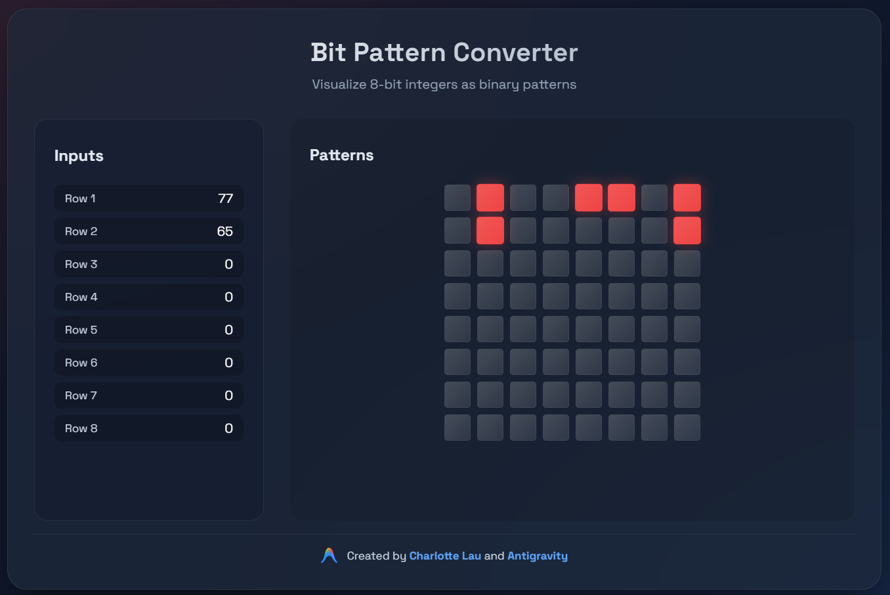

# Bit Pattern Converter

A client-side web application that converts 8-bit integers into visual binary bit patterns.

## Features
- **Interactive Grid**: Click on any bit in the grid to toggle it individually. The input value updates automatically.
- **Mobile Optimized**: Collapsible input panel ensures the grid remains the focus on smaller screens.
- **Deep Linking**: The state of the grid is synced to the URL hash (e.g., `#255,128...`), allowing you to share specific patterns.
- **Visual Feedback**: Real-time updates as you type.
- **Premium Design**: Dark mode with glassmorphism effects.
- **Official Branding**: Created by Charlotte Lau and Antigravity.

## How to Use
1. Open `index.html` in your browser.
2. Enter values from 0-255 in the text fields on the left.
3. Watch the bit patterns update instantly (Red = 1, Dimmed = 0).
4. **Pro Tip**: You can also click directly on the squares in the grid to toggle them!
5. Bookmark the URL to save your pattern.

## Technologies
- HTML5
- CSS3 (Vanilla)
- JavaScript (Vanilla)

## License
MIT
