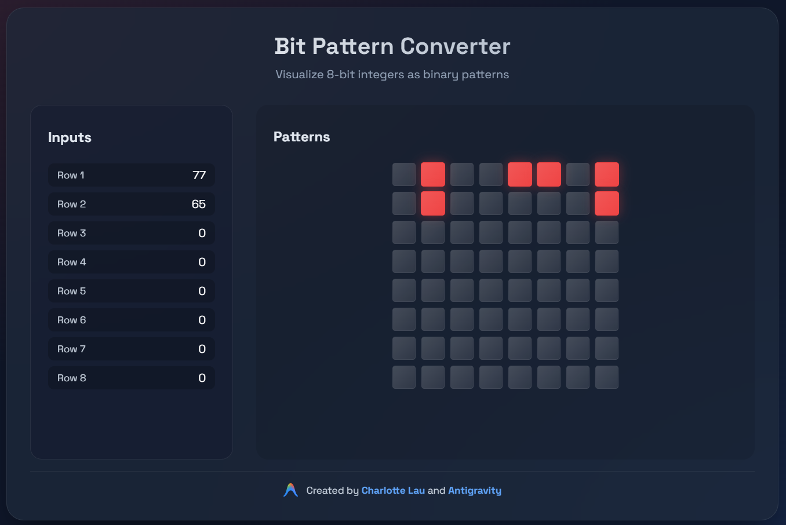

# Bit Pattern Converter

A client-side web application that converts 8-bit integers into visual binary bit patterns.

[**Live Demo**](https://charlotte-lau-hk.github.io/bit-pattern-converter/)

## Features
- **Interactive Grid**: Click on any bit in the grid to toggle it individually. The input value updates automatically.
- **Mobile Optimized**: Collapsible input panel ensures the grid remains the focus on smaller screens.
- **Deep Linking**: The state of the grid is synced to the URL hash (e.g., `#255,128...`), allowing you to share specific patterns.
- **Visual Feedback**: Real-time updates as you type.
- **Premium Design**: Dark mode with glassmorphism effects.
- **Official Branding**: Created by Charlotte Lau.

## Single file, works offline
`index.html` is the whole application — the CSS, the JavaScript, the author
avatar and the Space Grotesk webfont (latin subset, SIL OFL) are all inlined,
so the page makes **no network request at all** once you have the file. Save it
anywhere and double-click it; it runs the same with the Wi-Fi turned off, which
is the point when it is used in a classroom or demonstrated on unreliable venue
Wi-Fi. Chinese text uses the system CJK font (PingFang TC / Noto Sans TC /
Microsoft JhengHei) — no CJK webfont is embedded, since a usable subset would be
several megabytes.

The only two external URLs left are things you have to click: the author link
and the "Share to Classroom" button.

## How to Use
1. Open `index.html` in your browser (no server, no internet needed).
2. Enter values from 0-255 in the text fields on the left.
3. Watch the bit patterns update instantly (Red = 1, Dimmed = 0).
4. **Pro Tip**: You can also click directly on the squares in the grid to toggle them!
5. Bookmark the URL to save your pattern.

## Technologies
- HTML5
- CSS3 (Vanilla, inlined)
- JavaScript (Vanilla, inlined)

## License
MIT
